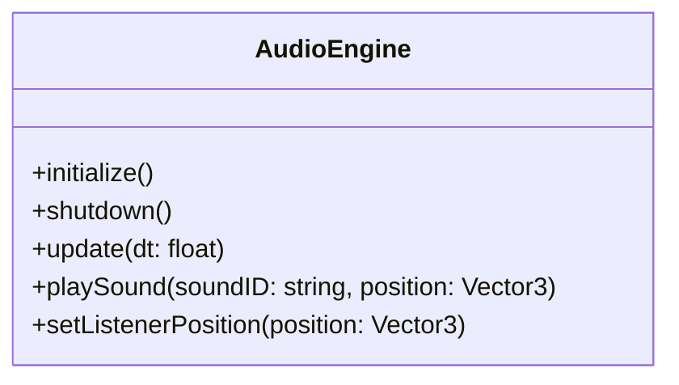
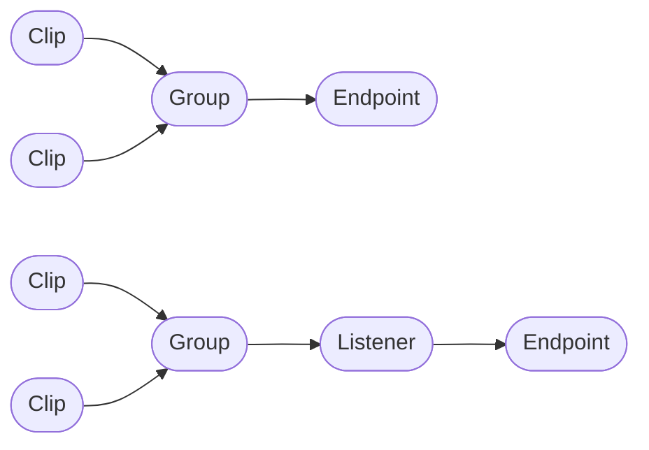
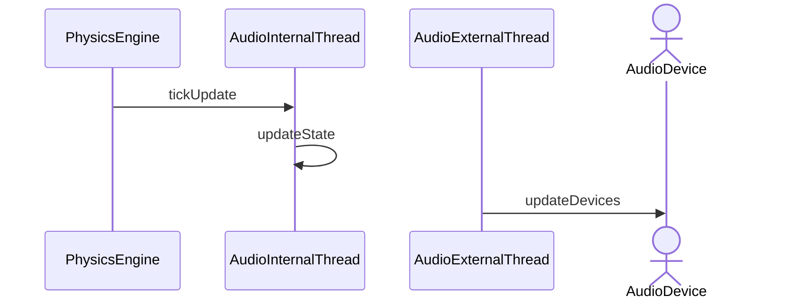

# WISL Audio Engine

Named after the distinctive sound of a tea kettle, the WISL audio engine powers Chai's game audio.

## Design

The Audio engine is split into two layers:

- logical - manages internal sound representation and attenuation based on physics environment
- physical - manages hardware audio execution

### Audio File Sourcing
- Audio Streaming
  - The ability to stream direct from file I/O.
- Fully Loaded Audio
  - Loads the entire audio clip before playback.

A centralized ring buffer is used for playback and buffering.

### Audio Prioritization

# The Structure of Audio Playback
- Listeners are the microphone of a game's audio engine.

# Audio-Physics Interaction

# Audio Effects
- Doppler effect - most audio does not play at the original pitch unless it's a background audio.
- Reverb is INTENSE on the CPU (25%) when built into the environment.
- Defer mixing and panning as late as possible because endpoints change.

