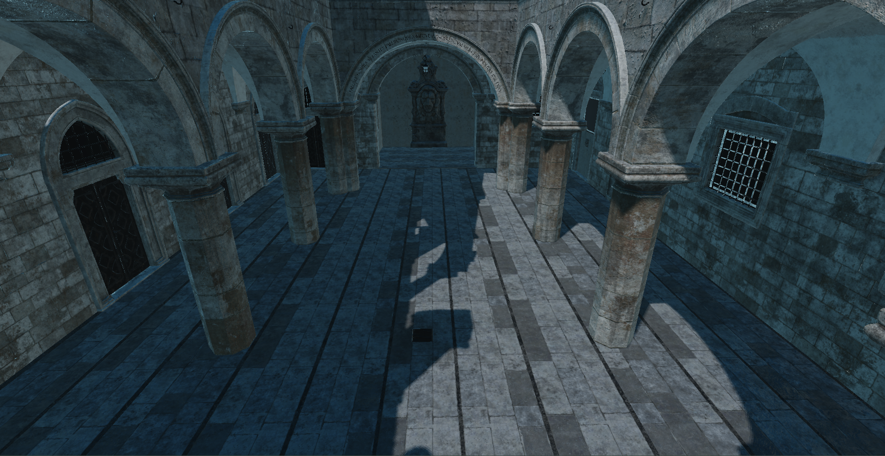
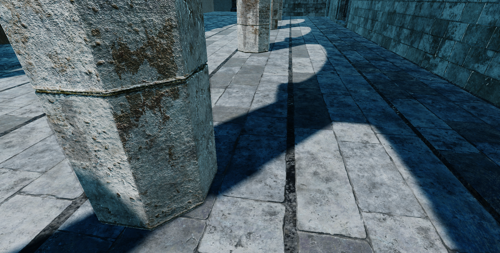
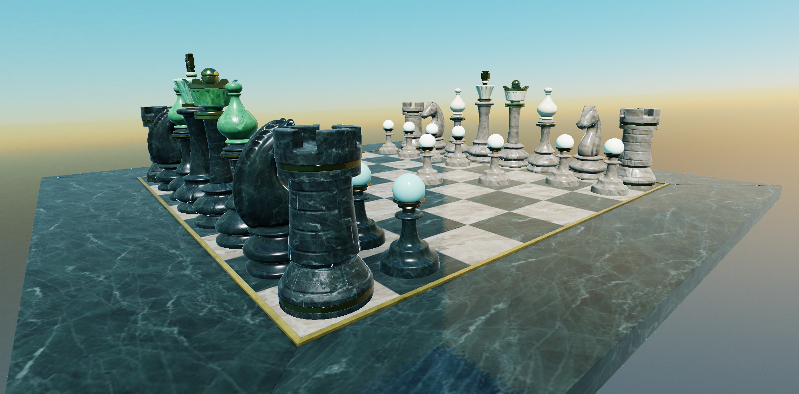

# Chai Engine

A Vulkan game engine built around a modern, physically-based renderer. Written in C++as a focused study of real-time rendering techniques and engine architecture. In active development




## About
 
ChaiEngine is a personal engine project aimed at building a clean, modern rendering pipeline from the ground up on Vulkan. The focus is on a well-factored render hardware interface, a physically-based shading model, image-based lighting, and an asset pipeline that handles resource lifetimes correctly.
 
At the moment, it is **rendering-focused** rather than a general-purpose game engine. See the status and roadmap sections for current and planned features.

## Status
 
> Honest snapshot of where things are. Implemented features work in the tested scenes below. The roadmap reflects planned work, not promises.

### Implemented
- **Vulkan backend** behind an interface abstraction layer
- **glTF 2.0 loading** (via cgltf) meshes, materials, textures, and node hierarchy
- **PBR metallic-roughness materials** with a Cook-Torrance BRDF
- **Image-based lighting** diffuse irradiance plus specular IBL (split sum: prefiltered environment map and a BRDF integration LUT)
- **Shadow mapping** directional shadow maps with 3×3 PCF filtering and depth bias
- **Skybox / cubemap rendering**
- **HDR pipeline with ACES filmic tonemapping**
- **Opaque / transparent pipeline split** with correct alpha blending
- **Scene layer** transform hierarchy and a component system
- **Asset system** generational handles, an asset cache, and a deferred-delete graveyard for safe GPU resource teardown
- **Three-layer asset architecture** cooked files -> CPU-side assets -> GPU resources
- **Plugin architecture** runtime DLL discovery with a service locator
- **ChaiMath** a header-only math library with full unit-test coverage
- Supporting infrastructure: type reflection, a pluggable logging sink (spdlog), and GLFW windowing
- Profiling integration via [Tracy](https://github.com/wolfpld/tracy).

### Roadmap
- Cascaded shadow maps
- Deferred rendering
- Material instances
- Physics Engine


## Architecture
 
The engine is organized into layers, so the renderer can evolve without the rest of the codebase reaching into Vulkan directly.
 
- **RHI layer** A backend-agnostic interface (enums, resource types, camera data) sitting in front of the Vulkan implementation. Pipelines are renderer-owned and shared. Materials own their texture handles.
- **Asset pipeline** Three stages (cooked -> CPU asset -> GPU resource) with clear ownership transfer. Resource lifetimes are managed through generational handles and a deferred-delete graveyard, which keeps GPU teardown ordering correct.
- **Scene layer** A transform hierarchy and component system that produces render data through an `update` / `extract` contract
- **Plugin system** A service-locator with runtime DLL discovery, so subsystems register themselves rather than being hard-wired.
- **ChaiMath** A standalone, header-only math library, unit-tested.

## Tech stack
 
- **Language:** C++20
- **Graphics API:** Vulkan
- **Key dependencies:** Vulkan SDK, Vulkan Memory Allocator (VMA), GLFW, cgltf, spdlog, tracy
- **Build system:** CMake
- **Platform:** Windows / Linux

## Building

### Required Linux dependencies

```bash
sudo apt install cmake g++ libwayland-dev libwayland-bin wayland-protocols pkg-config libxkbcommon-dev libxkbcommon-x11-dev libx11-dev x11-xserver-utils libxrandr-dev libxinerama-dev libxcursor-dev libxi-dev libgl-dev
```

### Steps
```bash
git clone https://github.com/debbie-liknes/ChaiEngine.git
cd ChaiEngine
git submodule update --init
mkdir build && cd build
cmake ..
start Chai.sln
```

## Tested scenes
 
Currently tested against **Intel Sponza** and a **VirtualCity** scene to validate asset loading, material handling, and the transparent/opaque split
