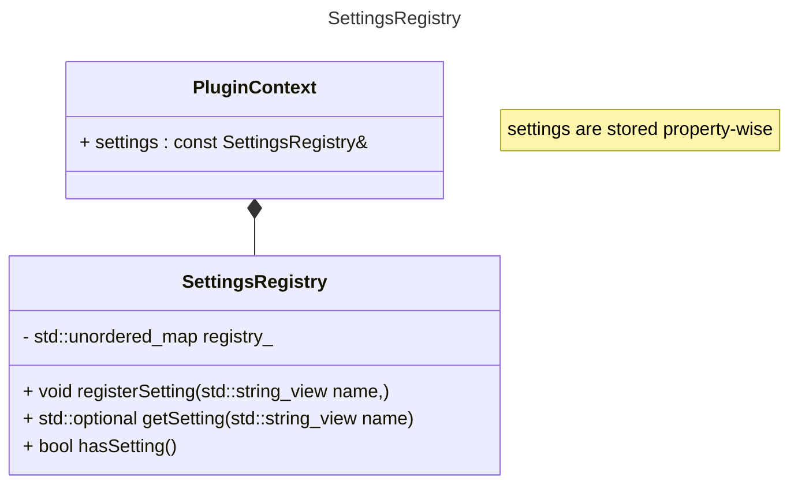

# Engine - Settings Component

- [ ] Define settings format for user styling
- [ ] Define settings format for plugin loading order
- [ ] Set up registry for loading / writing of settings

# Types

Leverages TOML
- Arrays
- Tables
- Inline tables
- Arrays of tables
- Integers & Floats
- Booleans
- Dates & Times, with optional offsets

# Diagrams

